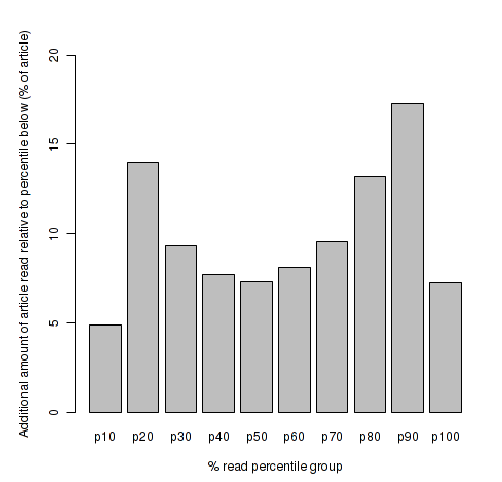
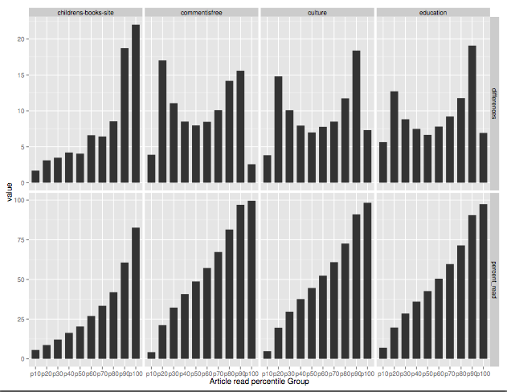

Who reads The Guardian?

# About 

We started collecting _engagement_ metrics in January to help us understand how people consume what is published to guardian.co.uk

For example, the _amount of an article read_ is a more useful metric than a _page view_ when it comes to understanding what people are interested in and what they are actually consuming.

A product built on top of producing & surfacing things that hold people's attention is smarter than one that understands things soley in terms of 'views', which tell us little about the user's interest in what we've invested the time writing for them.

## Definiton of read

We adapted Ophan to collect the following metrics for every user,

 - timeOnPage         : The time spent on an article page from load to exit.
 - timeReading        : The time spent 'reading' (when the article text appears in the viewport to exit).
 - wordsRead          : Average reading speed divided by the timeReading measurement.
 - wordCount          : The number of words in an article, taken from the Content API field.
 - percentageRead     : wordsRead expressed as a percentage of total wordCount.
 - percentageViewport : The percent of the article that appeared in the viewport.

The graphs below show *percentageRead*.

## Caveats

- Some people read slowly, word by word, others skim for relevent bits of information. These statitics are an approximation of behaviours. 
- This data is currently sampled from http://m.guardian.co.uk
- This is not a good way to track any sort of live blog. They grow over time and we don't correlate a growing article length with the amount read.
- The logging happens on the *next* subsequent page view, so we lose a certain amount of data from people who only show up once. 
- The data assumes a reading for comprehension speed of 200 word p/minute. This paints a overly negative picture.

## Distributions

There's two common reading patterns - _high engagement_ and _low engagement_.

### High engagement (readers)

This is an example of an article that got a high-level of engagement.

- The graph shows the _percentage of an article read._ It's grouped in to 10 percentile buckets.
- Follow the y-axis up to the 50% marker, and follow it across on the x-axis. You will hit the 70% bar. This is telling us that between 70-80% of people who started reading the article got at least to the 50% mark. This is good.
- It's a fairly long article (1700 words). Finding this pattern in a shorter article is less meaningful than the same pattern in a longer article.
- The article is this one - [chris-huhne-arrogant-good-mp-eastleigh](http://www.guardian.co.uk/politics/2013/feb/09/chris-huhne-arrogant-good-mp-eastleigh). 

### Low engagement (skimmers and dropouts)

Contrast the above with this next graph.

- Note that the left half the x-axis percentiles appear higher up the y-axis the the previous graph.
- Repeat the excercise above, following the y-axis to 50% then across, then draw it across to the x-axis. We end up at the 40% percentile bucket.
- This tells us that 40% of people who viewed the article dropped out before half-way.
- It's this article - [world/2013/feb/15/carnival-triumph-docks-alabama-ordeal](http://www.guardian.co.uk/world/2013/feb/15/carnival-triumph-docks-alabama-ordeal)

Take a look through some of the graphs in [World](world.html) and note the extremes of these two patterns.

## Averages

We can also look at averages across individual articles, sections, contributors, content-types.

For example, here's the 100 most popular CiF pieces over a month or so,

- This tells us that 50% of people to got the half-way point in the article (and 50% didn't). Or in other words, CiF falls towards the lower end of reader engagement.

## Patterns of dropout 

Drawing the same data in a different way helps us see the dropout pattern.

This graphs shows the differences between each percentile bucket in the previous graphs. It represents data averaged from ~5 weeks (28 Jan - 5 March 2013) of our most popular articles over the last month.

- This type of distribution is called bimodal, Ie. it has two most frequently occuring groups, which you can see on the left and right-hand sides of the x-axis. 
- This is telling us that a group of people drop out fairly quickly after viewing the page, and a large(r) group stick it out to the end.
- The dip in the middle indicates that the likelihood that once people have started the article, they will drop out fairly quickly _or_ continue reading to the end.
- I suspect some of the people in the left-hand group are quick readers and/or skimming the article, which would result in a lower _percentageRead_ metric.

## Time of day

When we draw the average words read at the time of day we see a downwards trend as the day goes on.

- I'm not sure what conclusion to draw from this.
- Given the dips tend to start at around 6am on many days I suspect the trend is just related to UK traffic.
- The drops correspond to football matches (we think)

# Data

You can compare 100 articles in each guardian.co.uk section.

- [World](world.html)
- [UK](uk.html)
- ... more soon!

There's some more summary graphs here,

- [Articles read by section](graphs/plots/article_percentage_read_by_section.pdf) [pdf]
- [More time graphs](graphs/plots/intraday_reading_stats_all_articles.pdf) [pdf]

## Per section article % read comparison 

# Further work

There's some more work needed.

- We are doing well if 50% of _page views_ translate in to our higher-engaged group (Ie. people that get beyond the 50% of article)
- Further work on correlation between length, content of article and reading time is needed.
- I'd like to pull out some quotable facts from the raw data.

